Taller de Raspberry
=================


# Tabla de contenidos

1. [Introducción al Raspberry Pi](#introducción-al-raspberry-pi)
2. [Manejo de los GPIO's](#manejo-de-los-gpios)
3. [Robot Móvil con Sensor de Temperatura y Humedad](#robot-móvil-con-sensor-de-temperatura-y-humedad)
4. [Bluetooth](#bluetooth)


# Introducción al Raspberry Pi


##	¿Qué es un Raspberry pi?

1. Es un ordenador de placa reducida de bajo coste.
2. Nació para estimular la enseñanza de ciencias de la computación en las escuelas del Reino Unido( plataforma educativa).
3. Actualmente es una plataforma de desarrollo.

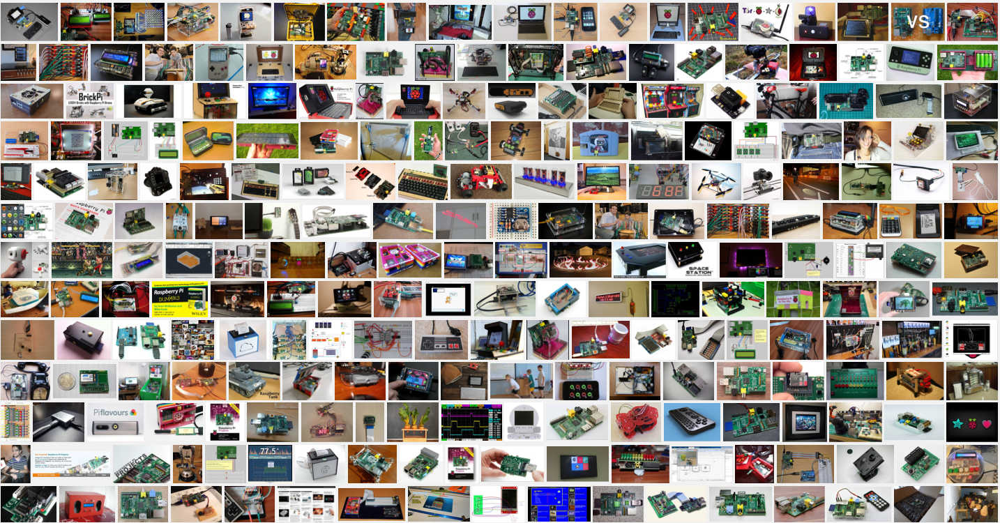

## Recursos

- SoC: Broadcom BCM2835 (CPU + GPU + DSP + SDRAM + puerto USB)
- CPU: ARM 1176JZF-S a 700 MHz (familia ARM11)
- Juego de instrucciones: RISC de 32 bits
- GPU: Broadcom VideoCore IV, OpenGL ES 2.0, MPEG-2 y VC-1 (con licencia), 1080p30 H.264/MPEG-4 AVC
- Memoria (SDRAM): 512 MiB (compartidos con la GPU)
- Puertos USB 2.0: 4
- Entradas de video: Conector MIPI CSI que permite instalar un
- módulo de cámara desarrollado por la RPF
- Salidas de video: Conector RCA (PAL y NTSC), HDMI (rev1.3 y 1.4), Interfaz DSI para panel LCD
- Salidas de audio: Conector de 3.5 mm, HDMI
- Almacenamiento integrado: MicroSD
- Conectividad de red: 10/100 Ethernet (RJ-45) via hub USB
- Periféricos de bajo nivel: GPIO, SPI, I2C, UART
- Consumo energético: 600 mA, (3.0 W)
- Fuente de alimentación: 5V v´ıa Micro USB o GPIO header
- Dimensiones: 85.60mm × 53.98mm
- Sistemas operativos soportados:GNU/Linux: Debian (Raspbian), Fedora (Pidora), Arch Linux (Arch Linux ARM), Slackware Linux. RISC OS

## Modelos

### RPI 1 Modelo A
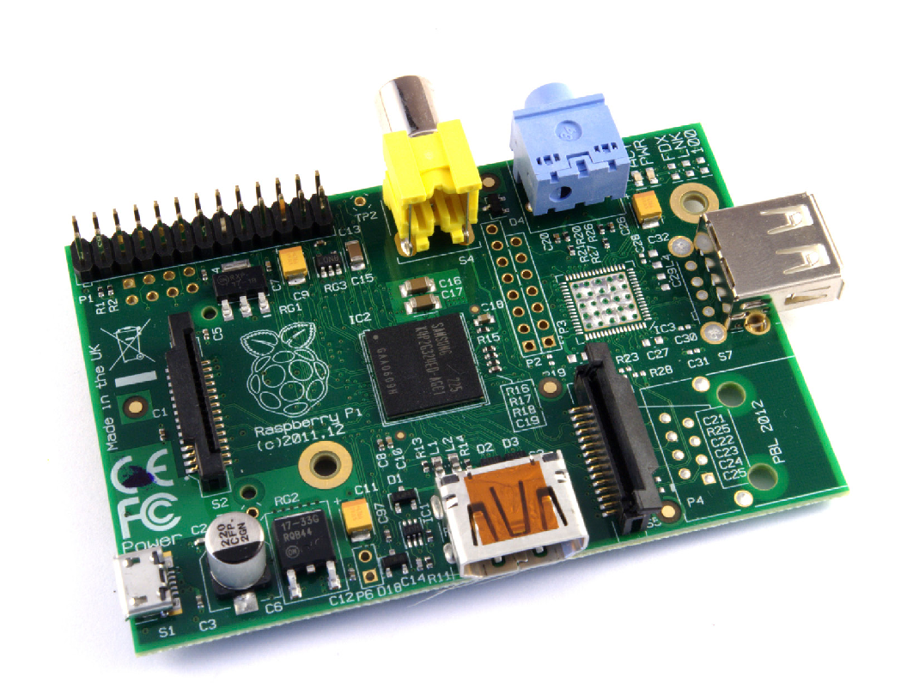

### RPI 1 Modelo A+
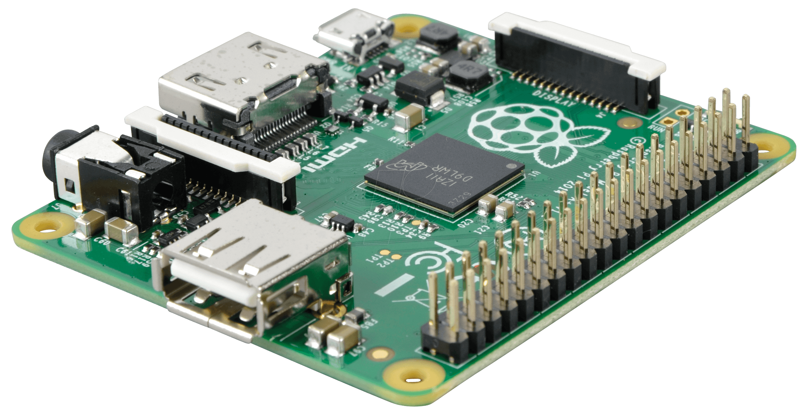

### RPI 1 Modelo B
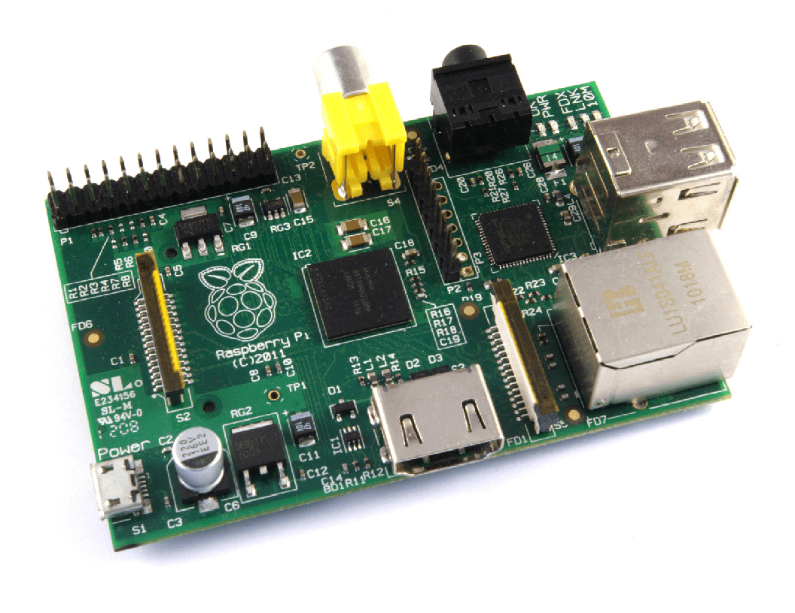

### RPI 1 Modelo B+
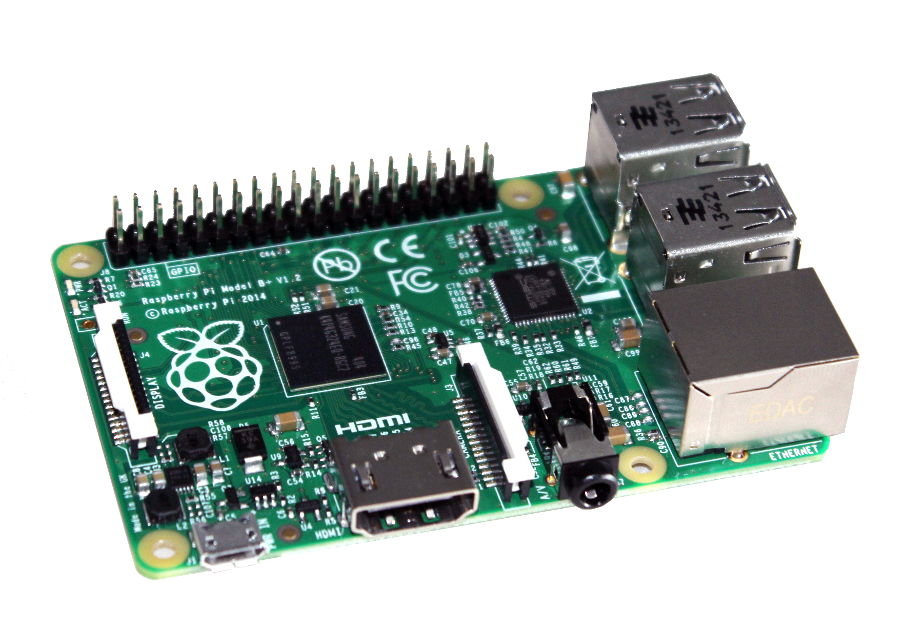

### RPI 2 Modelo B
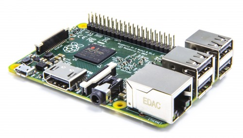

### RPI ZERO
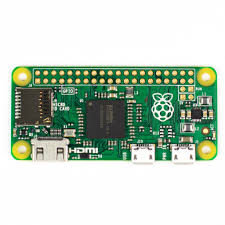

### RPI 3 Modelo B
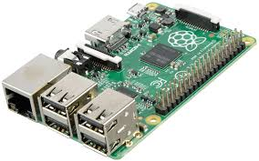


|               |RPI 1 Model A		|RPI 1 Model A+	 	|RPI 1 Model B		|RPI 1 Model B+	|RPI Model 2 Model B| RPI Zero| RPI 3 Model B|
|---------------|:-------------:|:-------------:|:-------------:|:-----------:|:-------------:|:--------------:|:-------:|
|SoC|	Broadcom BCM2835| Broadcom BCM2835|Broadcom BCM2835|Broadcom BCM2835|Broadcom BCM2836| Broadcom BCM2835|BCM287 |
|CPU| ARMv6 700 MHz| ARM11 ARMv6 700 MHz| ARM11 ARMv6 700 MHz| ARM11 ARMv6 700 MHz| ARM11 ARMv7 ARM Cortex-A7 4 núcleos @ 900 MHz| ARM11 ARMv6 Dual Core 1 GHz| ARM cortex A53 1.2GHz 64bit 4 núcleos|
|GPU|Broadcom VideoCore IV 250 MHz. OpenGL ES 2.0 |Broadcom VideoCore IV 250 MHz. OpenGL ES 2.0| Broadcom VideoCore IV 250 MHz. OpenGL ES 2.0| Broadcom VideoCore IV 250 MHz. OpenGL ES 2.0	| Broadcom VideoCore IV 250 MHz. OpenGL ES 2.0| Broadcom VideoCore IV 250 MHz. OpenGL ES 2.0|Broadcom VideoCore IV 250 MHz. OpenGL ES 2.0 |
|RAM| 256 MB LPDDR SDRAM 400 MHz| 256 MB LPDDR SDRAM 400 MHz| 512 MB LPDDR SDRAM 400 MHz| 512 MB LPDDR SDRAM 400 MHz| 1 GB LPDDR2 SDRAM 450 MHz| 512 MB LPDDR SDRAM 400 MHz| 1 GB LPDDR2 SDRAM 450 MHz|
|USB| 1 USB 2.0|1 USB 2.0|2 USB 2.0|4 USB 2.0|4 USB 2.0| 1 microUSB 2.0| 4 USB 2.0|
|Salidas de vídeo|HDMI 1.4 @ 1920x1200 píxeles|HDMI 1.4 @ 1920x1200 píxeles|HDMI 1.4 @ 1920x1200 píxeles|HDMI 1.4 @ 1920x1200 píxeles|HDMI 1.4 @ 1920x1200 píxeles|mini-HDMI 1.4 @ 1920x1200 píxeles | HDMI 1.4 @ 1920x1200 píxeles |
|Almacenamiento|SD/MMC|microSD|SD/MMC|microSD|microSD|microSD| microSD|
|Ethernet|No|No|Sí, 10/100 Mbps|Sí, 10/100 Mbps|Sí, 10/100 Mbps| No | 10/100 Mbit/s Ethernet 802.11n wireless Bluetooth 4.1 |
|Tamaño	|85,60mmx56,5 mm|65mmx56,5 mm|85,60mmx56,5 mm|85,60mmx56,5 mm|85,60mmx56,5 mm|65mmx30mm|85,60mmx56,5 mm|
|Peso   |45 g.|23 g.|45 g.|45 g.|45 g.|9 g| 45g|
|Precio	|25 dólares|20 dólares|35 dólares|35 dólares|35 dólares|5 dólares| 35 dólares|

## Herramientas

### Windows

- Win32DiskImager [(Descargar)](http://sourceforge.net/projects/win32diskimager/files/latest/download
)
- Putty [(Descargar)](https://the.earth.li/~sgtatham/putty/latest/x86/putty-0.67-installer.msi)
- WinSCP [(Descargar)](https://winscp.net/eng/download.php#download2)
- Advanced IP Scanner [(Descargar)](http://www.filehippo.com/download_advanced_ip_scanner/?utm_source=FT&utm_medium=Redirect&utm_campaign=AIS)
- SDFormater [(Descargar)](https://www.sdcard.org/downloads/formatter_4/eula_windows/SDFormatterv4.zip)

### Linux

```console
$ sudo dd bs=4M if=/path/of/raspbian-image.img of=/dev/mmcblk0
$ sudo apt-get -y install nmap
$ sudo nmap -sn ip.of.red.0/24
$ ssh pi@your.rpi.ip.address
$ scp your_archivo pi@your.rpi.ip.address:"/home/pi"
```

### Materiales

- MicroSD
- Cable ethernet
- Fuente de 5V 2amp
- Raspberry pi
- PC
- Software Putty
- Cable HDMI(opcional)
- Teclado(opcional)
- Mouse(opcional)
- Usb Wifi(opcional)

### Instalacion de SO

1. SO Raspbian, descargarlo de la página oficial de Raspberry Pi desde [aquí](https://www.raspberrypi.org/downloads/raspbian/)
2. una memoría microSD de al menos 4Gb (recomiendo que sea de clase 10)
3. software para grabar el SO en la memoria microSD, en este caso optaremos por Win32DiskImager

El usuario por defecto es `pi` y la contraseña `raspberry`

### Primera conexión:

Formaremos una red local entre el Rpi y la PC para poder acceder a esta sin necesidad de una pantalla y teclado ni demás conectores.Los materiales que se necesitaremos son:

Despues de grabar la memoría microSD con Raspbian, lo insertamos en la pc y vamos a editar el archivo cmdline.txt:

```
 pi@raspberrypi:~ $ nano boot/cmdline.txt
 dwc_otg.lpm_enable=0 console=ttyAMA0,115200 <...> rootwait ip=your.rpi.ip.address
```

Luego insertamos la memoria en el raspberry pi, y alimentamos la raspberry pi, en paralelo cambiamos la configuración de ethernet en nuestra PC con la siguiente configuración:

```
ip address: your.rpi.ip.another_address
netmask: 255.255.255.0
gateway: your.rpi.ip.address
```

Y conectamos la Rpi con la PC mediante el cable ethernet, luego abrimos el programa Putty y colocaremos la ip del raspberry pi, aceptamos la llave SSH y colocamos el usuario:pi y la contraseña:raspberry cuando nos pidan. Luego de esto configuramos una mejor conexión ya sea cableada o inalámbrica.

Desde [https://www.raspberrypi.org/documentation/remote-access/ssh/](https://www.raspberrypi.org/documentation/remote-access/ssh/) :

> As of the November 2016 release, Raspbian has the SSH server disabled by default.
>  You will have to enable it manually. This is done using raspi-config: 
> Enter sudo raspi-config in the terminal, first select Interfacing options, then navigate to  ssh, press
> Enter and select Enable or disable ssh server.
> For headless setup, SSH can be enabled by placing a file named 'ssh', without any extension, onto the boot partition of the SD card.

Segun un aviso de la actualización, se removio el acceso ssh por defecto por lo que no se podrá seguir el manual para versiones posteriores a Noviembre del 2016.

En los foros nos muestra una solución para la version Lite de raspbian. Primero debemos ingresar al archivo cmdline.txt añadir lo siguiente:

Para poder habilitarlo debemos crear un archivo llamado ssh sin extensiones en la carpeta boot, esto habilitará dicho protócolo.

```
ip=192.168.1.200::192.168.1.1:255.255.255.0:rpi:eth0:off
```
Esta estructuta tiene la forma: 
```
ip=<client-ip>:<server-ip>:<gw-ip>:<netmask>:<hostname>:<device>:<autoconf>
```

En el caso de nuestra computadora debemos configurarlo como:

```
$ ip address: 192.168.1.xxx
$ netmask: 255.255.255.0
$ gateway: 192.168.1.1
```

**Nota**: La creación del archivo ***ssh*** habilta el protócolo ssh en 
***RASPBIAN JESSIE WITH PIXEL*** pero la configuración de ip estática genera que el boot no se complete.

#### Cableada(IP Dinámica)

No editamos nada pero necesitaremos un software que escanee la red como Advanced IP Scanner donde buscaremos la red que tenga como fabricante a Raspberry Pi Foundation.

#### Cableada(IP Estática)

Editamos el archivo interfaces:

```
pi@raspberrypi:~ $ sudo nano /etc/networks/interfaces
```

y cambiamos a:

```
 auto eth0
 #iface eth0 inet dhcp
 iface eth0 inet static
 address 192.168.1.11
 netmask 255.255.255.0
 gateway 192.168.1.1 #dirección ip del router
```

#### Inalámbrica

 Editamos el archivo wpa_supplicant.conf:&nbsp:

```
pi@raspberrypi:~ $ sudo nano /etc/wpa_supplicant/wpa_supplicant.conf
```
y cambiamos a:

```
network={
    ssid="Your ssid"
    psk="your wifi password"
}
```

En ambos casos reiniciar la Rpi y conectarse ahora por el nuevo IP a través del cliente SSH, en nuestro caso Putty(en el caso de una red inalámbrica averigue su IP con Advanced IP Scanner )

Si la Raspberry Pi tiene acceso a internet comprobamos si esta bien configurado con el siguiente comando:
```
pi@raspberrypi:~ $ ping -c 3 8.8.8.8
PING 8.8.8.8 (8.8.8.8) 56(84) bytes of data.
64 bytes from 8.8.8.8: icmp_seq=1 ttl=45 time=173 ms
64 bytes from 8.8.8.8: icmp_seq=2 ttl=45 time=180 ms
64 bytes from 8.8.8.8: icmp_seq=3 ttl=45 time=172 ms
--- 8.8.8.8 ping statistics ---
3 packets transmitted, 3 received, 0% packet loss, time 2002ms
rtt min/avg/max/mdev = 172.677/175.469/180.461/3.554 ms
```

Y sino tendremos que configurar el DNS, para ello editamos el archivo /etc/resolv.conf

```
pi@raspberrypi:~ $ sudo nano /etc/resolv.conf
nameserver 8.8.8.8
nameserver 8.8.4.4
```

###	Comandos en GNU-Linux

Algunos de los miles de comandos de linux!!!

| Comando 	|Función 			| Uso 								|
|-----------|-------------------|-----------------------------------
|man 		|manual  			| ``$ man man``						|
|ls 		|ver los ficheros de un directorio	| ``$ ls /home/pi``					|
|cd 		| Cambiar de directorio	| ``$ cd ..``						|
|mv          | Mover archivos	|``$ mv carpeta1 carpeta2``			|
|rm 		| Remover 			|``$ rm archivo.txt``				|
|rmdir 		|remover directorio 	|``$ rmdir carpeta``				|
|mkdir 		|Crear directorio 	|``$ mkdir carpeta``				|
|cp 		|Copiar 				|``$ cp archivo1.txt archivo2.txt``	|
|find 		|Buscar 				|``$ find archivo.txt``				|
|locate 	|Localizar 			|``$ locate archivo.txt``			|
|shutdown  | Apagar el sistema |``$ shutdown -h now``|
|reboot | Reiniciar| `$ reboot`|

##	Uso del editor Nano
```sh
$ nano name_of_file
```

## raspi-config

La herramienta Raspi-config le ayuda a configurar su Raspberry Pi; varios ajustes se pueden cambiar con esta herramienta sin tener que conocer los comandos correctos para su uso.

```console
$ sudo raspi-config
```

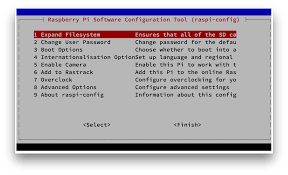

## Escritorio Remoto: VNC

```console
$ sudo apt-get install tightvncserver
$ vncserver :1 -geometry 1280x800 -depth 16 -pixelformat rgb565
```

Para windows descargar desde [aquí](https://www.realvnc.com/download/binary/1795/)

Para linux instalar:
```console
pi@raspberrypi:~ $ sudo apt-get -y install 
```

ingresar con **your.rpi.ip.address:1**


## Editor remoto: Sublime

Usar la terminal para editar no es amigable, por ello recurrimos a esta gran utilidad.

### Instalar sublime

1. Instalar sublime desde [aquí](https://download.sublimetext.com/Sublime%20Text%202.0.2a%20x64%20Setup.exe)
2. Instalar Package Control
	Ejecutar View/Console y pegar
```perl
import urllib2,os,hashlib; h = '2915d1851351e5ee549c20394736b442' + '8bc59f460fa1548d1514676163dafc88'; pf = 'Package Control.sublime-package'; ipp = sublime.installed_packages_path(); os.makedirs( ipp ) if not os.path.exists(ipp) else None; urllib2.install_opener( urllib2.build_opener( urllib2.ProxyHandler()) ); by = urllib2.urlopen( 'http://packagecontrol.io/' + pf.replace(' ', '%20')).read(); dh = hashlib.sha256(by).hexdigest(); open( os.path.join( ipp, pf), 'wb' ).write(by) if dh == h else None; print('Error validating download (got %s instead of %s), please try manual install' % (dh, h) if dh != h else 'Please restart Sublime Text to finish installation')
```
3. Ejecutar ctrl-shift-p, escribir install y seleccionar rsub

### Instalar rmate

```bash
pi@raspberrypi:~ $ sudo wget -O /usr/local/bin/rsub https://raw.github.com/aurora/rmate/master/rmate
pi@raspberrypi:~ $ sudo chmod +x /usr/local/bin/rsub
```

### Configurar Putty

1. Ejecutar como administrador putty
2. Seleccionar Connection/SSH/tunnels
3. Colocar en **Source port**: 52698, en **Destination**:127.0.0.1:52698 y seleccionar **Remote**

### USO

```bash
pi@raspberrypi:~ $ rsub your_file
```

### Resumen

	pi@raspberrypi:~ $ sudo apt-get update
	pi@raspberrypi:~ $ sudo apt-get upgrade
	pi@raspberrypi:~ $ sudo apt-get install -y tree
	pi@raspberrypi:~ $ sudo apt-get install -y mlocate
	pi@raspberrypi:~ $ sudo updatedb

# Manejo de los GPIO's


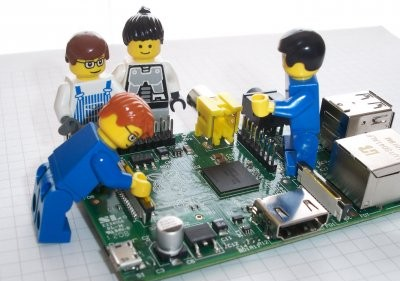


## Datasheet

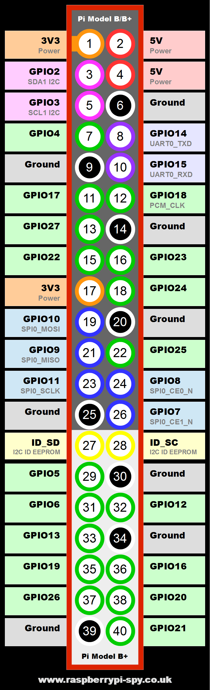

## Python

### Instalación
```console
pi@raspberrypi:~ $ sudo apt-get -y update
pi@raspberrypi:~ $ sudo apt-get -y upgrade
pi@raspberrypi:~ $ sudo apt-get -y install python-dev
pi@raspberrypi:~ $ sudo apt-get -y install python-rpi.gpio
```

### LED

> Un led es un componente electrónico cuya función principal es convertir la energía eléctrica en una fuente luminosa, la palabra led proviene del acrónimo ingles Light Emmiting Diode o diodo emisor de luz.

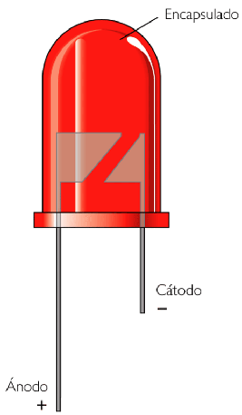

#### [Blink](https://github.com/CodeHuntersLab/RaspberryPi/blob/master/GPIO/blink.py) 
```python
#!/usr/bin/python
import RPi.GPIO as GPIO
import time

led = 18  # GPIO18
delay = 1  # one second
GPIO.setwarnings(False)  # disable warnings
GPIO.setmode(GPIO.BCM)  # mode BCM or Board
GPIO.setup(led, GPIO.OUT)  # input or output
isRunning = True
while isRunning:
    try:
        GPIO.output(led, True)
        time.sleep(delay)
        GPIO.output(led, False)
        time.sleep(delay)
    except KeyboardInterrupt:
        isRunning = False
GPIO.cleanup()
```

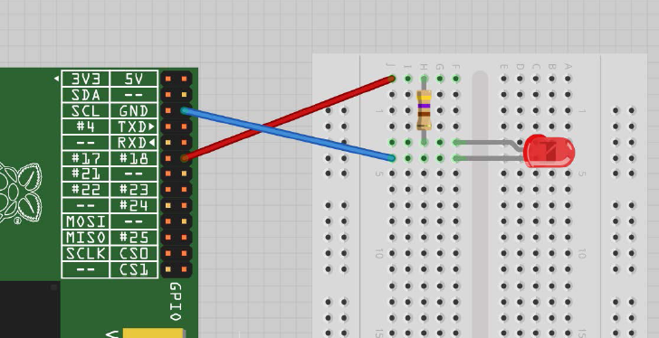

#### [PWM](https://github.com/CodeHuntersLab/RaspberryPi/blob/master/GPIO/pwm.py)
```python
#!/usr/bin/python
import RPi.GPIO as GPIO

led = 18  # GPIO18
GPIO.setwarnings(False)  # disable warnings
GPIO.setmode(GPIO.BCM)  # mode BCM or Board
GPIO.setup(led, GPIO.OUT)  # input or output
pwm_led = GPIO.PWM(led, 500)
pwm_led.start(100)
isRunning = True
while isRunning:
    try:
        duty_s = raw_input("Enter Brightness (0 to 100): ")
        duty = int(duty_s)
        pwm_led.ChangeDutyCycle(duty)
    except KeyboardInterrupt:
        isRunning = False
GPIO.cleanup()
```

### Pulsador

#### [Switch 1](https://github.com/CodeHuntersLab/RaspberryPi/blob/master/GPIO/switch1.py)

>Los pulsadores (PUSHBUTTONS), son interruptores que al ser accionados de forma manual cambian de estado y al soltarlo regresan a su estado inicial


```python
#!/usr/bin/python
import RPi.GPIO as GPIO
import time

switch = 18  # GPIO18
delay = 0.2  # 0.2 seconds
GPIO.setwarnings(False)  # disable warnings
GPIO.setmode(GPIO.BCM)  # mode BCM or Board
GPIO.setup(switch, GPIO.IN, pull_up_down=GPIO.PUD_UP)  # input or output
isRunning = True
while isRunning:
    try:
        input_state = GPIO.input(switch)
        if not input_state:
            print("Button Pressed")
        time.sleep(delay)
    except KeyboardInterrupt:
        isRunning = False
GPIO.cleanup()
```

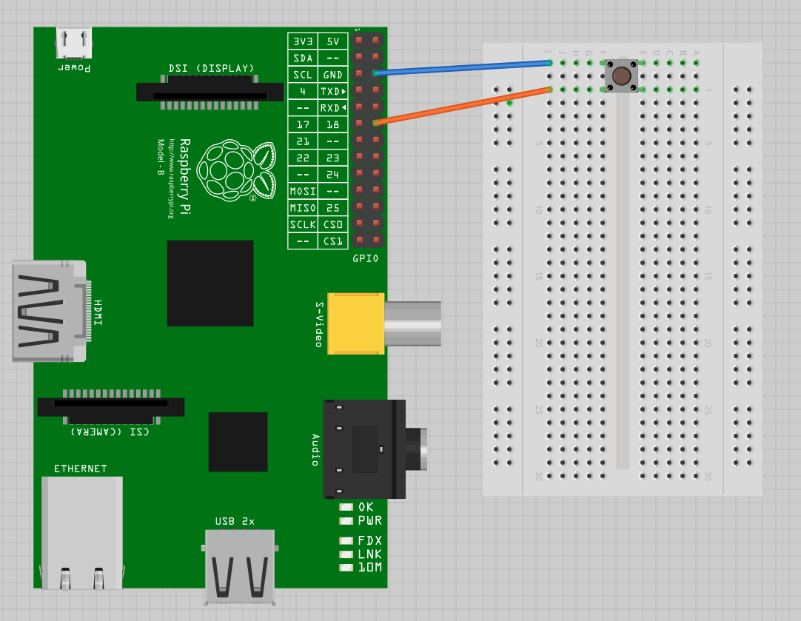

#### [Switch 2](https://github.com/CodeHuntersLab/RaspberryPi/blob/master/GPIO/switch2.py)

```python
#!/usr/bin/python
import RPi.GPIO as GPIO
import time

led = 18  # GPIO18
switch = 23
GPIO.setwarnings(False)  # disable warnings
GPIO.setmode(GPIO.BCM)  # mode BCM or Board
GPIO.setup(led, GPIO.OUT)  # input or output
GPIO.setup(switch, GPIO.IN, pull_up_down=GPIO.PUD_UP)
led_state = False
old_input_state = True
isRunning = True
while isRunning:
    try:
        new_input_state = GPIO.input(switch)
        if not new_input_state and old_input_state:
            led_state = not led_state
        old_input_state = new_input_state
        GPIO.output(led, led_state)
    except KeyboardInterrupt:
        isRunning = False
GPIO.cleanup()
```

### [Ultrasonido](https://github.com/CodeHuntersLab/RaspberryPi/blob/master/GPIO/ultrasound.py)

> Los sensores de ultrasonidos o sensores ultrasónicos son detectores de proximidad que trabajan libres de roces mecánicos y que detectan objetos a distancias que van desde pocos centímetros hasta varios metros. El sensor emite un sonido y mide el tiempo que la señal tarda en regresar. Estos reflejan en un objeto, el sensor recibe el eco producido y lo convierte en señales eléctricas, las cuales son elaboradas en el aparato de valoración

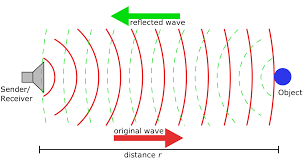

```python
import RPi.GPIO as GPIO
import time

TRIG = 23
ECHO = 24

GPIO.setmode(GPIO.BCM)

print "Distance Measurement In Progress"
GPIO.setup(TRIG, GPIO.OUT)
GPIO.setup(ECHO, GPIO.IN)

isRunning = True
while isRunning:
    try:
        GPIO.output(TRIG, False)
        print "Waiting For Sensor To Settle"
        time.sleep(2)
        GPIO.output(TRIG, True)
        time.sleep(0.00001)
        GPIO.output(TRIG, False)
        while GPIO.input(ECHO) == 0:
            pulse_start = time.time()
        while GPIO.input(ECHO) == 1:
            pulse_end = time.time()
        pulse_duration = pulse_end - pulse_start
        distance = pulse_duration * 17150
        distance = round(distance, 2)
        print "Distance:", distance, "cm"
    except KeyboardInterrupt:
        isRunning = False
GPIO.cleanup()
```

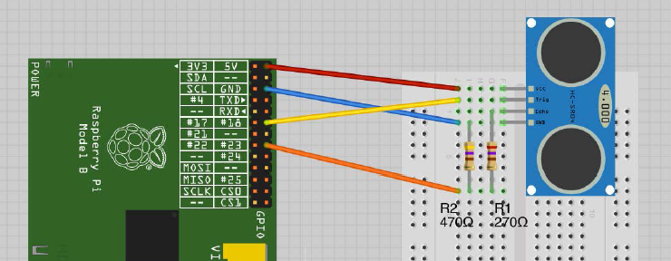

### [Servomotor](https://github.com/CodeHuntersLab/RaspberryPi/blob/master/GPIO/servomotor.py) 
> Un servomotor (también llamado servo) es un dispositivo similar a un motor de corriente continua que tiene la capacidad de ubicarse en cualquier posición dentro de su rango de operación, y mantenerse estable en dicha posición.


```python
from Tkinter import *
import RPi.GPIO as GPIO
import time


class App:
    def __init__(self, master):
        frame = Frame(master)
        GPIO.setmode(GPIO.BCM)
        GPIO.setup(18, GPIO.OUT)
        pwm = GPIO.PWM(18, 100)
        pwm.start(5)
        frame.pack()
        scale = Scale(frame, from_=0, to=180, orient=HORIZONTAL, command=self.update)
        scale.grid(row=0)

    def update(self, angle):
        duty = float(angle) / 10.0 + 2.5
        pwm.ChangeDutyCycle(duty)

    def __exit__(self, exc_type, exc_val, exc_tb):
        GPIO.cleanup()


root = Tk()
root.wm_title('Servo Control')
app = App(root)
root.geometry("200x50+0+0")
root.mainloop()
```
### [DHTXX](https://github.com/CodeHuntersLab/RaspberryPi/blob/master/GPIO/DHT.py)

## Instalación
```console
pi@raspberrypi:~ $ sudo apt-get -y update
pi@raspberrypi:~ $ sudo apt-get -y install python-pip
pi@raspberrypi:~ $ sudo pip install adafruit_python_dht
```

```python
import Adafruit_DHT
import time

isRunning = True
while isRunning:
    try:
        humidity, temperature = Adafruit_DHT.read_retry(Adafruit_DHT.DHT11, 4)
        if humidity is not None and temperature is not None:
            print('Temp={0:0.1f}*  Humidity={1:0.1f}%'.format(temperature, humidity))
        else:
            print('Failed to get reading. Try again!')
        time.sleep(1)
    except KeyboardInterrupt:
        isRunning = False

```

## C

```console
pi@raspberrypi:~ $ sudo apt-get install -y wiringpi
```

### Resumen

```console
pi@raspberrypi:~ $ sudo apt-get -y update
pi@raspberrypi:~ $ sudo apt-get -y upgrade
pi@raspberrypi:~ $ sudo apt-get install -y python-dev
pi@raspberrypi:~ $ sudo apt-get install -y python-rpi.gpio
pi@raspberrypi:~ $ sudo apt-get install -y python-pip
pi@raspberrypi:~ $ sudo pip install adafruit_python_dht
```


# Robot Móvil con Sensor de Temperatura y Humedad

El proyecto que se implementará consiste en el monitoreo de sensores y control de actuadores mediante una interfaz web.

En la siguiente imagen se muestra un esquema simple de la aplicación, esta se compondrá de todas principales:

1. **Aplicación WEB:** muestra los datos guardados en la base de datos.

2. **Servicio o Demonio:** lectura de los datos que proporciona los sensores y guardarlo en la base de datos.

3. **Control de Motores:** Control de los motores

4. **Otros Clientes:** Ejemplos de Posibles clientes

5. **Motion:** Coniguramos motion para mostar la imagen de la cámara a traves de la interfaz web.

Esta arquitectura tiene como cualidad de ser simple y escalable.

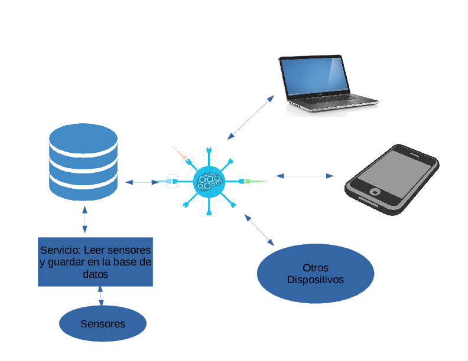 


## Aplicación WEB:

Para esta parte implementaremos un servicio restful.

Usaremos como framework [django](http://www.django-rest-framework.org/) , para implementar con facilidad el servicio restful añadiremos [django rest framework](http://www.django-rest-framework.org/) .

Como primer paso instalaremos un entorno virtual llamado **virtualenv**

```console
pi@raspberrypi:~ $ sudo apt-get install -y python-pip
pi@raspberrypi:~ $ sudo pip install virtualenv
```

Teniendo instalado virtualenv, creamos un entorno de trabajo que llamaremos **rpi-env**:

```console
pi@raspberrypi:~ $ mkdir ~/projects
pi@raspberrypi:~ $ cd ~/projects
pi@raspberrypi:~/projects $ virtualenv rpi-env
```
Lo activamos con:

```console
pi@raspberrypi:~/projects $ source rpi-env/bin/activate
```
Teniendo todo lo anterior instalamos django y django-rest-framework:

```console
(rpi-env) pi@raspberrypi:~/projects $ pip install django
(rpi-env) pi@raspberrypi:~/projects $ pip install djangorestframework
```

Creamos un proyecto llamado **Raspberry** y una aplicación llamada **Domo**:

```console
(rpi-env) pi@raspberrypi:~/projects $ django-admin.py startproject Raspberry
(rpi-env) pi@raspberrypi:~/projects $ cd Raspberry
(rpi-env) pi@raspberrypi:~/projects/Raspberry $ ./manage.py startapp Domo
(rpi-env) pi@raspberrypi:~/projects/Raspberry $ ./manage.py migrate
```

Para verificar que vamos por buen camino ejecutamos el siguiente comando para visualizar la estructura de carpetas generadas:

```console
(rpi-env)  pi@raspberrypi:~/projects/Raspberry $ tree 
```

Debiendo obtener lo siguiente:

		.
	├── db.sqlite3
	├── Domo
	│   ├── admin.py
	│   ├── apps.py
	│   ├── __init__.py
	│   ├── models.py
	│   ├── serializers.py
	│   ├── tests.py
	│   ├── urls.py
	│   ├── views.py
	├── manage.py
	├── Raspberry
	│   ├── __init__.py
	│   ├── settings.py
	│   ├── urls.py
	│   └── wsgi.py
	├── README.md
	├── static
	│   ├── js
	│   │   ├── motors.js
	│   │   └── sensors.js
	│   └── vendor
	│       ├── jquery.min.js
	│       └── plotly-latest.min.js
	└── templates
	    └── index.html


Vamos a hacer una pequeña prueba para ello editamos el archivo settings.py y añadimos  la ip del raspberry(en mi caso '192.168.2.9')  en la linea ALLOWED_HOSTS = []

```console
(rpi-env) pi@raspberrypi:~/projects/Raspberry $ nano Raspberry/settings.py
```

```bash
[...]
	ALLOWED_HOSTS = ['192.168.2.9']
[...]
```

Y luego lanzamos el servidor de desarrollo:
```console
(rpi-env) pi@raspberrypi:~/projects/Raspberry $ ./manage.py runserver 0.0.0.0:8000
```

Ingresamos desde nuestra pc a un buscador y colocamos la ip del raspberry seguido del puerto 8000, en mi caso http://192.168.2.9:8000/ y deberiamos obtener algo similar a lo que muestra la siguiente imagen:


Para apagar el servidor apretamos Ctrl+C

Lo primero que haremos es crear un modelo de la base de datos, para ello usaremos la ORM de django, editamos el archivo models.py que se encuentra dentro de la carpeta Domo. Hacemos los mismo con serializers.py

```console
(rpi-env) pi@raspberrypi:~/projects/Raspberry $ nano Domo/models.py 
```

**Domo/models.py**

```python
from __future__ import unicode_literals

from django.db import models


class Sensor(models.Model):
    date_created = models.DateTimeField(auto_now=True)
    temperature = models.FloatField()
    humidity = models.FloatField()

STATUS_CHOICES = (
    ('F', 'Forward'),
    ('B', 'Backward'),
    ('L', 'Left'),
    ('R', 'Right'),
    ('S', 'Stop')
)


class Motor(models.Model):
    date_created = models.DateTimeField(auto_now=True)
    status = models.CharField(max_length=1, choices=STATUS_CHOICES, default='S')
```

```console
(rpi-env) pi@raspberrypi:~/projects/Raspberry $ nano Domo/serializers.py
```

**Domo/serializers.py**

```python
from rest_framework import serializers

from Domo.models import Sensor, Motor


class SensorSerializer(serializers.ModelSerializer):
    class Meta:
        model = Sensor
        fields = ('id', 'date_created', 'temperature', 'humidity')


class MotorSerializer(serializers.ModelSerializer):
    class Meta:
        model = Motor
        fields = ('id', 'date_created', 'status')
```
```console
(rpi-env) pi@raspberrypi:~/projects/Raspberry $ nano Domo/views.py
```
**Domo/views.py**
```python
from django.shortcuts import render
from rest_framework import viewsets

from Domo.models import Sensor, Motor
from Domo.serializers import SensorSerializer, MotorSerializer


class SensorViewSet(viewsets.ModelViewSet):
    queryset = Sensor.objects.all().order_by('-id')
    serializer_class = SensorSerializer


class MotorViewSet(viewsets.ModelViewSet):
    queryset = Motor.objects.all().order_by('-id')
    serializer_class = MotorSerializer


def home(request):
    return render(request, 'index.html')
```

```console
(rpi-env) pi@raspberrypi:~/projects/Raspberry $ nano Domo/urls.py
```

**Domo/urls.py**
```python
from rest_framework import routers

from Domo.views import SensorViewSet, MotorViewSet

router = routers.DefaultRouter()
router.register(r'sensors', SensorViewSet)
router.register(r'motors', MotorViewSet)

urlpatterns = router.urls
```
```console
(rpi-env) pi@raspberrypi:~/projects/Raspberry $ nano Domo/admin.py
```

**Domo/admin.py**
``` python
from django.contrib import admin

from Domo.models import Sensor, Motor


@admin.register(Sensor)
class SensorAdmin(admin.ModelAdmin):
    list_display = ('date_created', 'temperature', 'humidity')


@admin.register(Motor)
class MotorAdmin(admin.ModelAdmin):
    list_display = ('date_created', 'status')
```

Luego añadimos la aplicación Domo al proyecto:

```console
(rpi-env) pi@raspberrypi:~/projects/Raspberry $ nano Raspberry/settings.py
```

**Raspberry/settings.py**
``` python
[...]

BASE_DIR = os.path.dirname(os.path.dirname(os.path.abspath(__file__)))
PROJECT_DIR = os.path.split(os.path.dirname(__file__))[0]

[...]

INSTALLED_APPS = [
    'django.contrib.admin',
    'django.contrib.auth',
    'django.contrib.contenttypes',
    'django.contrib.sessions',
    'django.contrib.messages',
    'django.contrib.staticfiles',

    # Aplicaciones de terceros
    'rest_framework',
    # Aplicaciones creadas
    'Domo',

]

[...]


TEMPLATES = [
    {
        'BACKEND': 'django.template.backends.django.DjangoTemplates',
        'DIRS': [os.path.join(BASE_DIR, 'templates')], # modificamos esta parte
        'APP_DIRS': True,
        'OPTIONS': {
            'context_processors': [
                'django.template.context_processors.debug',
                'django.template.context_processors.request',
                'django.contrib.auth.context_processors.auth',
                'django.contrib.messages.context_processors.messages',
            ],
        },
    },
]

[...]

STATIC_URL = '/static/'

STATIC_ROOT = os.path.join(BASE_DIR, '../static/')

STATICFILES_DIRS = (
    # Put strings here, like "/home/html/static" or "C:/www/django/static".
    # Always use forward slashes, even on Windows.
    # Don't forget to use absolute paths, not relative paths.
    # os.path.join(PROJECT_DIR, "static").replace('\\', '/'),
    os.path.join(PROJECT_DIR, "static").replace('\\', '/'),
)

REST_FRAMEWORK = {
    'DEFAULT_PAGINATION_CLASS': 'rest_framework.pagination.PageNumberPagination',
    'PAGE_SIZE': 10
}

```

```console
(rpi-env) pi@raspberrypi:~/projects/Raspberry $ nano Raspberry/urls.py
```

**Raspberry/urls.py**

```python
"""Raspberry URL Configuration

The `urlpatterns` list routes URLs to views. For more information please see:
    https://docs.djangoproject.com/en/1.10/topics/http/urls/
Examples:
Function views
    1. Add an import:  from my_app import views
    2. Add a URL to urlpatterns:  url(r'^$', views.home, name='home')
Class-based views
    1. Add an import:  from other_app.views import Home
    2. Add a URL to urlpatterns:  url(r'^$', Home.as_view(), name='home')
Including another URLconf
    1. Import the include() function: from django.conf.urls import url, include
    2. Add a URL to urlpatterns:  url(r'^blog/', include('blog.urls'))
"""
from django.conf.urls import url, include
from django.contrib import admin

from Domo.views import home

urlpatterns = [
    url(r'^admin/', admin.site.urls),
    url(r'^api/', include('Domo.urls', namespace='core')),
    url(r'^$', home),
]
```

```console
(rpi-env) pi@raspberrypi:~/projects/Raspberry $ mkdir templates
(rpi-env) pi@raspberrypi:~/projects/Raspberry $ nano templates/index.html
```
**templates/index.html**

```html



<!DOCTYPE html>
<html>
<head>
    <meta charset="UTF-8">
    <title>Proyecto</title>
</head>

<body>
<div id="header">
    <h2 style="text-align: center">Proyecto</h2>
</div>

<div style="text-align:center;margin:auto;">
    <button onclick="forward()">Avanzar</button>
</div>

<div style="text-align:center;margin:auto;">
    <button onclick="backward()">Retroceder</button>
</div>

<div style="text-align:center;margin:auto;">
    <button onclick="left()">Izquierda</button>
</div>

<div style="text-align:center;margin:auto;">
    <button onclick="right()">Derecha</button>
</div>

<div style="text-align:center;margin:auto;">
    <button onclick="stop()">Parar</button>
</div>

<p style="text-align:center;">
    
</p>


<div id="content">
    <div class="demo-container">
        <div id="placeholder" style="margin:0 auto;"></div>
        <br>
        <div style="width:1000px;margin:0 auto;">
            Actualizar: <input type="checkbox" id="myCheck" checked>
            <br>
            Time : <input type="number" id="interval" value="1000">
            <br>
            <label id="lblLast"></label>
        </div>
    </div>
</div>
</body>

<script type="text/javascript" src=""></script>
<script type="text/javascript" src=""></script>
<script type="text/javascript" src=""> </script>
<script type="text/javascript" src=""> </script>

</html>
```

```console
(rpi-env) pi@raspberrypi:~/projects/Raspberry $ mkdir static
(rpi-env) pi@raspberrypi:~/projects/Raspberry $ mkdir static/vendor
(rpi-env) pi@raspberrypi:~/projects/Raspberry $ wget -O static/vendor/jquery.min.js https://ajax.googleapis.com/ajax/libs/jquery/3.1.1/jquery.min.js
(rpi-env) pi@raspberrypi:~/projects/Raspberry $ wget -O static/vendor/plotly-latest.min.js https://cdn.plot.ly/plotly-latest.min.js
(rpi-env) pi@raspberrypi:~/projects/Raspberry $ mkdir static/js
(rpi-env) pi@raspberrypi:~/projects/Raspberry $ nano static/js/sensors.js
```
**static/js/sensors.js**
```javascript
$(document).ready(function () {
    var temperature = {
        x: [],
        y: [],
        fill: 'tonexty',
        type: 'scatter',
        name: 'Temperatura'
    };


    var humidity = {
        x: [],
        y: [],
        fill: 'tonexty',
        type: 'scatter',
        name: 'Humedad',
        yaxis: 'y2'
    };

    var layout = {
        title: 'Sensores',
        showlegend: true,
        legend: {
            x: 0,
            y: 1,
            traceorder: 'normal',
            font: {
                family: 'sans-serif',
                size: 12,
                color: '#000'
            },
            bgcolor: '#E2E2E2',
        },
        yaxis: {
            title: '°C',
            range: [0, 100]
        },
        yaxis2: {
            title: '%',
            side: 'right',
            overlaying: 'y',
            range: [0, 100]
        }
    };

    var data = [humidity, temperature];

    var updateInterval = 1000;
    // Load all posts on page load
    function GetData() {
        $.ajax({
            url: "/api/sensors/", // the endpoint
            type: "GET", // http method
            // handle a successful response
            success: function (data) {
               
                results = data['results'];
                temperature['x'] = [];
                temperature['y'] = [];

                humidity['x'] = [];
                humidity['y'] = [];

                $.each(results, function (index, value) {
                    temperature['x'].push(new Date(value['date_created']));
                    temperature['y'].push(value['temperature']);

                    humidity['x'].push(new Date(value['date_created']));
                    humidity['y'].push(value['humidity']);
                });
            },
            // handle a non-successful response
            error: function (xhr, errmsg, err) {

            }
        });

    };

    function update() {
        GetData();

        if (document.getElementById("myCheck").checked) {
            Plotly.newPlot('placeholder', data, layout);
            document.getElementById('lblLast').innerHTML = "Temperatura Actual: " +
                temperature['y'][0] + "<br>Humedad Actual: " + humidity['y'][0];
        }
        var interval = Number(document.getElementById("interval").value);
        if (!isNaN(interval)) {
            updateInterval = interval;
        }
        setTimeout(update, updateInterval);
    }

    update();
});
```
```console
(rpi-env) pi@raspberrypi:~/projects/Raspberry $ nano static/js/motors.js
```
**static/js/motors.js**
```javascript
var ip = location.host;
document.getElementById("ip_link").src = "http://" + ip + ":8081";

// Load all posts on page load
function move(state) {
    $.ajax({
        url: "/api/motors/", // the endpoint
        type: "POST", // http method
        // handle a successful response
        success: function (data) {

        },
        data: {
            'status': state
        },
        // handle a non-successful response
        error: function (xhr, errmsg, err) {

        }
    });

};

function forward() {
    move('F');
};

function backward() {
    move('B');
};

function left() {
    move('L');
};

function right() {
    move('R');
};

function stop() {
    move('S');
};
```


```console
(rpi-env) pi@raspberrypi:~/projects/Raspberry $ ./manage.py makemigrations
(rpi-env) pi@raspberrypi:~/projects/Raspberry $ ./manage.py migrate
(rpi-env) pi@raspberrypi:~/projects/Raspberry $ ./manage.py collectstatic
(rpi-env) pi@raspberrypi:~/projects/Raspberry $ ./manage.py runserver 0.0.0.0:8000
```

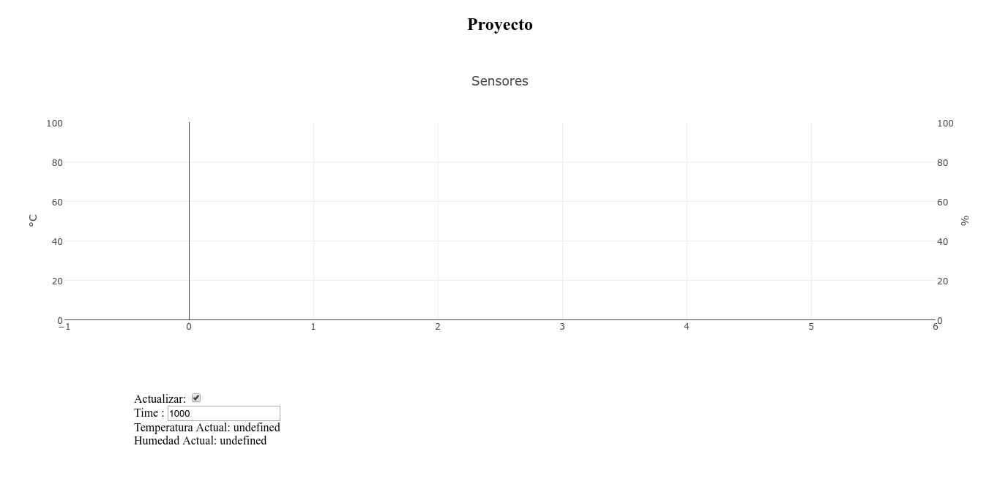

```console
(rpi-env) pi@raspberrypi:~/projects/Raspberry $ cd
(rpi-env) pi@raspberrypi:~ $ deactivate
```

Ahora instalamos el servidor Apache:

```console
pi@raspberrypi:~ $ sudo apt-get install -y apache2 libapache2-mod-wsgi
```

Despues de instalamos editamos el archivo 000-default.conf ubicado en  **/etc/apache2/sites-available **, añadiendo lo siguiente antes de **< /VirtualHost >**

```console
pi@raspberrypi:~ $ sudo nano /etc/apache2/sites-available/000-default.conf
```
```bash
[...]
Alias /static /home/pi/projects/static
<Directory /home/pi/projects/static>
	Require all granted
</Directory>
<Directory /home/pi/projects/Raspberry/Raspberry>
	<Files wsgi.py>
		Require all granted
	</Files>
</Directory>
WSGIDaemonProcess projects python-path=/home/pi/projects/Raspberry python-home=/home/pi/projects/rpi-env
WSGIProcessGroup projects
WSGIScriptAlias / /home/pi/projects/Raspberry/Raspberry/wsgi.py
</VirtualHost>
[...]
```

Luego le damos permisos a las carpetas y archivos.

```console
pi@raspberrypi:~ $ sudo chmod 664  ~/projects/Raspberry/db.sqlite3 
pi@raspberrypi:~ $ sudo chown www-data ~/projects/Raspberry/db.sqlite3 
pi@raspberrypi:~ $ sudo chown www-data ~/projects/Raspberry
pi@raspberrypi:~ $ sudo service apache2 restart
```

Ahora podremos ingresar directamente a la ip sin necesidad de indicar el puerto ni ejecutar ningun comando ya que se esta ejecutando el servidor de producción.

## Servicio o Demonio

Creamos un archivo llamado **myservice.py**

```console
pi@raspberrypi:~ $ mkdir myservice
pi@raspberrypi:~ $ nano myservice/myservice.py
```
**myservice.py**

```python
#!/usr/bin/env python
import logging
import logging.handlers
import argparse
import sys
from datetime import datetime
import sqlite3
import Adafruit_DHT


def getSensors():
    humidity, temperature = Adafruit_DHT.read_retry(Adafruit_DHT.DHT11, 4)
    t = datetime.utcnow()
    return t, temperature, humidity
# Deafults
LOG_FILENAME = "/tmp/myservice.log"
LOG_LEVEL = logging.INFO  # Could be e.g. "DEBUG" or "WARNING"

# Define and parse command line arguments
parser = argparse.ArgumentParser(description="My simple Python service")
parser.add_argument("-l", "--log", help="file to write log to (default '" + LOG_FILENAME + "')")

# If the log file is specified on the command line then override the default
args = parser.parse_args()
if args.log:
        LOG_FILENAME = args.log

# Configure logging to log to a file, making a new file at midnight and keeping the last 3 day's data
# Give the logger a unique name (good practice)
logger = logging.getLogger(__name__)
# Set the log level to LOG_LEVEL
logger.setLevel(LOG_LEVEL)
# Make a handler that writes to a file, making a new file at midnight and keeping 3 backups
handler = logging.handlers.TimedRotatingFileHandler(LOG_FILENAME, when="midnight", backupCount=3)
# Format each log message like this
formatter = logging.Formatter('%(asctime)s %(levelname)-8s %(message)s')
# Attach the formatter to the handler
handler.setFormatter(formatter)
# Attach the handler to the logger
logger.addHandler(handler)

# Make a class we can use to capture stdout and sterr in the log
class MyLogger(object):
        def __init__(self, logger, level):
                """Needs a logger and a logger level."""
                self.logger = logger
                self.level = level

        def write(self, message):
                # Only log if there is a message (not just a new line)
                if message.rstrip() != "":
                        self.logger.log(self.level, message.rstrip())

# Replace stdout with logging to file at INFO level
sys.stdout = MyLogger(logger, logging.INFO)
# Replace stderr with logging to file at ERROR level
sys.stderr = MyLogger(logger, logging.ERROR)

conn = sqlite3.connect('/home/pi/projects/Raspberry/db.sqlite3')
curs = conn.cursor()

while True:
    curs.execute("INSERT INTO Domo_sensor(date_created, temperature, humidity) VALUES( (?), (?), (?))", getSensors())
    conn.commit()
conn.close()
```
```console
pi@raspberrypi:~ $ nano myservice.sh
```
**myservice.sh**
```bash
#!/bin/sh

### BEGIN INIT INFO
# Provides:          myservice
# Required-Start:    $remote_fs $syslog
# Required-Stop:     $remote_fs $syslog
# Default-Start:     2 3 4 5
# Default-Stop:      0 1 6
# Short-Description: Put a short description of the service here
# Description:       Put a long description of the service here
### END INIT INFO

# Change the next 3 lines to suit where you install your script and what you want to call it
DIR=/usr/local/bin/myservice
DAEMON=$DIR/myservice.py
DAEMON_NAME=myservice

# Add any command line options for your daemon here
DAEMON_OPTS=""

# This next line determines what user the script runs as.
# Root generally not recommended but necessary if you are using the Raspberry Pi GPIO from Python.
DAEMON_USER=root

# The process ID of the script when it runs is stored here:
PIDFILE=/var/run/$DAEMON_NAME.pid

. /lib/lsb/init-functions

do_start () {
    log_daemon_msg "Starting system $DAEMON_NAME daemon"
    start-stop-daemon --start --background --pidfile $PIDFILE --make-pidfile --user $DAEMON_USER --chuid $DAEMON_USER --startas $DAEMON -- $DAEMON_OPTS
    log_end_msg $?
}
do_stop () {
    log_daemon_msg "Stopping system $DAEMON_NAME daemon"
    start-stop-daemon --stop --pidfile $PIDFILE --retry 10
    log_end_msg $?
}

case "$1" in

    start|stop)
        do_${1}
        ;;

    restart|reload|force-reload)
        do_stop
        do_start
        ;;

    status)
        status_of_proc "$DAEMON_NAME" "$DAEMON" && exit 0 || exit $?
        ;;

    *)
        echo "Usage: /etc/init.d/$DAEMON_NAME {start|stop|restart|status}"
        exit 1
        ;;

esac
exit 0
```
```console
pi@raspberrypi:~ $ sudo chmod 755 myservice/myservice.py
pi@raspberrypi:~ $ sudo chmod +x myservice.sh
pi@raspberrypi:~ $ sudo cp myservice.sh /etc/init.d
pi@raspberrypi:~ $ sudo update-rc.d myservice.sh defaults
pi@raspberrypi:~ $ sudo cp -rf myservice/ /usr/local/bin/
pi@raspberrypi:~ $ sudo service myservice start
```
Salida:
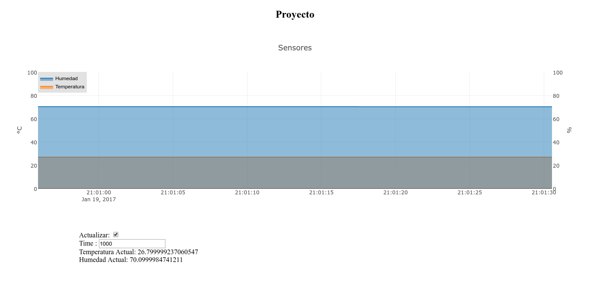


## Control de Motores:

Luego implementamos la clase **Car**  que se encarga de manejar los movimientos del vehículo.

**Car.py**

```python
import RPi.GPIO as GPIO
import time


class Car:
    def __init__(self, motorL, motorR, t=0.2):
        """
        Manejar los motores
        :param pins:
        [in1, in2, in3, in4]
        """
        GPIO.setmode(GPIO.BCM)
        self._pinsA = motorL
        self._pinsB = motorR
        self.t = t 

        for pin in (self._pinsA + self._pinsB):
            GPIO.setup(pin, GPIO.OUT)

    def motorOn(self, pins):
        GPIO.output(pins[0], False)
        GPIO.output(pins[1], True)

    def motorOff(self, pins):
        GPIO.output(pins[0], False)
        GPIO.output(pins[1], False)

    def motorReverse(self, pins):
        GPIO.output(pins[0], True)
        GPIO.output(pins[1], False)

    def forward(self):
        self.stop()
        self.motorOn(self._pinsA)
        self.motorOn(self._pinsB)
        time.sleep(self.t)
        self.stop()

    def backward(self):
        self.stop()
        self.motorReverse(self._pinsA)
        self.motorReverse(self._pinsB)
        time.sleep(self.t)
        self.stop()

    def left(self):
        self.stop()
        self.motorOn(self._pinsB)
        self.motorReverse(self._pinsA)
        time.sleep(self.t)
        self.stop()

    def right(self):
        self.stop()
        self.motorOn(self._pinsA)
        self.motorReverse(self._pinsB)
        time.sleep(self.t)
        self.stop()

    def stop(self):
        self.motorOff(self._pinsA)
        self.motorOff(self._pinsB)

    def __exit__(self, exc_type, exc_val, exc_tb):
        GPIO.cleanup()
```


Ahora creamos la clase **Data** que se encarga de obtener los datos, filtrar el último y verificar si este ha sido creado en menos de 1 segundo. Si cumple lo anterior obtenemos el comando  **status** y realizamos la tarea respectiva.

** main.py **

```python
#!/usr/bin/env python
from datetime import datetime, timedelta
from Car import Car
import requests
import RPi.GPIO as GPIO
import socket

class Data:
    def __init__(self, url, timeout=1):
        self.url = url
        self.before = None
        self.timeout = timeout

    def load(self):
        response = requests.get(self.url)
        s = response.headers['date']
        u = datetime.strptime(s, "%a, %d %b %Y %H:%M:%S %Z")
        assert response.status_code == 200
        data = response.json()['results'][0]
        date = datetime.strptime(data['date_created'][:-1], "%Y-%m-%dT%H:%M:%S.%f")
        if self.before == date:
            return
        self.before = date
        # u = datetime.utcnow()
        diff = u - date
        if diff < timedelta(seconds=1.5):
            return data['status']


#http://stackoverflow.com/questions/166506/finding-local-ip-addresses-using-pythons-stdlib
def get_ip():
    s = socket.socket(socket.AF_INET, socket.SOCK_DGRAM)
    try:
        # doesn't even have to be reachable
        s.connect(('10.255.255.255', 0))
        IP = s.getsockname()[0]
    except:
        IP = '127.0.0.1'
    finally:
        s.close()
    return IP


if __name__ == '__main__':
    host = get_ip()
    print(host)
    data = Data(url='http://'+host+'/api/motors/')
    motorL = [17, 27]
    motorR = [23, 24]
    car = Car(motorL, motorR, 1)

    while True:
        try:
            resp = data.load()
            if resp == 'F':
                car.forward()
            elif resp == 'B':
                car.backward()
            elif resp == 'L':
                car.left()
            elif resp == 'R':
                car.right()
            elif resp == 'S':
                car.stop()
        except (KeyboardInterrupt, SystemExit):
	       GPIO.cleanup()
	    break
```

## Otros Clientes

### Petición de Datos

```python
import requests
import datetime

url = 'http://192.168.2.9/api/sensors/'

response = requests.get(url)
assert response.status_code == 200

for data in response.json():
    date = datetime.datetime.strptime(data['date_created'][:-1], "%Y-%m-%dT%H:%M:%S.%f")
    humidity = data['humidity']
    temperature = data['temperature']
    print("Fecha: {}, Humedad: {}, Temperatura: {}".format(date, humidity, temperature))
```

### Envio de Datos:

```python
import requests
import datetime
import json
import time

url = 'http://192.168.2.9/api/sensors/'

 for i in range(100):
	date = datetime.datetime.utcnow().strftime('%Y-%m-%dT%H:%M:%S.%fZ')

	headers = {'Content-type': 'application/json'}
	response = requests.post(url,  data =json.dumps({'date_created': date,'temperature': 11.1, 'humidity': 10.1}), headers=headers)
	assert response.status_code == 201
	time.sleep(0.1)
```


### ESP8266

Para realizar esta parte es necesario tener instalado las herramientas necesarias para compilar y quemar el *ESP8266*

### esp8266-restclient [link](https://github.com/csquared/arduino-restclient) 

```console
cd ~/Documents/Arduino
mkdir libraries
cd libraries
git clone https://github.com/dakaz/esp8266-restclient.git RestClient
```

### SimpleDHT [link](https://github.com/winlinvip/SimpleDHT)

```console
cd ~/Documents/Arduino
mkdir libraries
cd libraries
git clone https://github.com/winlinvip/SimpleDHT.git SimpleDHT
```

Código del cliente:

```cpp
#include <RestClient.h>
#include <ESP8266WiFi.h>
#include <SimpleDHT.h>


const char* ssid     = "{your ssid}";
const char* password = "{your password}";

const char* host = "{your ip or domain}";

RestClient client = RestClient(host);

int pinDHT11 = 2;
SimpleDHT11 dht11;

void setup() {
    Serial.begin(115200);
    delay(10);
    client.setContentType("application/json");
    // We start by connecting to a WiFi network
    
    Serial.println();
    Serial.println();
    Serial.print("Connecting to ");
    Serial.println(ssid);
    
    /* Explicitly set the ESP8266 to be a WiFi-client, otherwise, it by default,
     would try to act as both a client and an access-point and could cause
     network-issues with your other WiFi-devices on your WiFi-network. */
    WiFi.mode(WIFI_STA);
    WiFi.begin(ssid, password);
    
    while (WiFi.status() != WL_CONNECTED) {
        delay(500);
        Serial.print(".");
    }
    
    Serial.println("");
    Serial.println("WiFi connected");
    Serial.println("IP address: ");
    Serial.println(WiFi.localIP());
}

String response;
char buffer[50];
void loop(){
    byte temperature = 0;
    byte humidity = 0;
    if (dht11.read(pinDHT11, &temperature, &humidity, NULL)) {
        Serial.print("Read DHT11 failed.");
        return;
    }
    
    response = "";
    sprintf (buffer, "{\"temperature\": %d, \"humidity\": %d}",(int)temperature, (int)humidity);
    int statusCode = client.post("/api/sensors/", buffer , &response);
    if(statusCode == 201){;
        Serial.println(response);
    }
    delay(2000);
}
```

## Motion

Creamos un directorio para guardar las imagenes:

```console
pi@raspberrypi:~ $ mkdir  /home/pi/Monitor
pi@raspberrypi:~ $ sudo chgrp motion /home/pi/Monitor
pi@raspberrypi:~ $ sudo chmod g+rwx /home/pi/Monitor
pi@raspberrypi:~ $ sudo chmod -R g+w /home/pi/Monitor/
```
Instalamos la librería **motion**.

```console
pi@raspberrypi:~ $ sudo apt-get install -y motion
```
Editamos el archivo motion.conf, buscando los siguientes campos y los cambiamos a lo siguientes valores:

```console
pi@raspberrypi:~ $ sudo nano /etc/motion/motion.conf
```

	stream_localhost off
	webcontrol_localhost off
	framerate 60
	target_dir /home/pi/Monitor


Editamos el archivo **/etc/default/motion** y cambiamos de **no** a **yes**

```console
pi@raspberrypi:~ $ sudo nano /etc/default/motion
```
	start_motion_daemon=yes

Despues ejecutamos lo siguiente:

```console
pi@raspberrypi:~ $ sudo service motion stop
pi@raspberrypi:~ $ sudo service motion start
```
	
Y Accedemos a la imagen de la cámara a traves de la url desde nuestro buscador: http://{your-rpi-address}:8081/ 

Obteniendo lo siguiente:

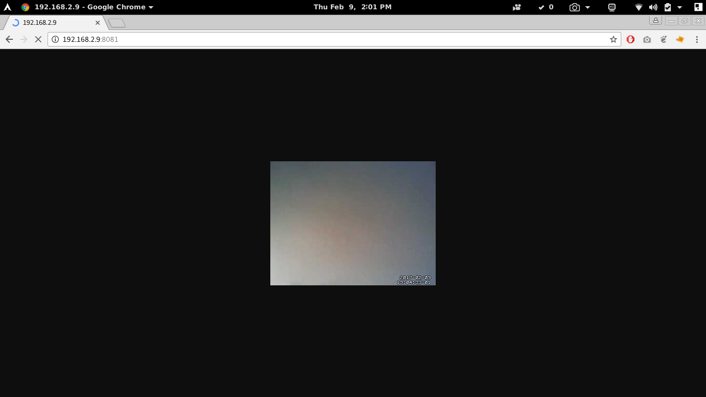 


Las imagenes y videos pueden llenar el almacenamiento, por ello configuramos que pasada los 15 minutos despues de cada hora borre todos excepto las 20 ultimas imagenes:

```console
pi@raspberrypi:~ $ sudo crontab -e
```

	15 * * * * (date; ls /home/pi/Monitor/*.jpg | head -n -20 | xargs rm -v) >> /tmp/images_deleted 2>&1


## Resumen

Para los alumnos del curso es necesario ejecutar los siguientes comandos:

	sudo apt-get -y update
	sudo apt-get -y upgrade
	sudo apt-get install -y python-dev
	sudo apt-get install -y python-rpi.gpio
	sudo apt-get install -y python-pip
	sudo pip install adafruit_python_dht
	sudo pip install virtualenv
	mkdir ~/projects
	cd ~/projects
	virtualenv rpi-env
	source rpi-env/bin/activate
	pip install django
	pip install djangorestframework
	sudo apt-get install -y apache2 libapache2-mod-wsgi
	sudo apt-get install -y motion


### BLUETOOTH

**bluecarpy.py**

```python
from bluetooth import *
from Car import Car

import os

os.system("sudo hciconfig hci0 name \'raspberrypi-0\'")

os.system("sudo hciconfig hci0 piscan")

server_sock = BluetoothSocket(RFCOMM)
server_sock.bind(("", PORT_ANY))
server_sock.listen(1)

port = server_sock.getsockname()[1]

uuid = "94f39d29-7d6d-437d-973b-fba39e49d4ee"

advertise_service(server_sock, "AquaPiServer",
                  service_id=uuid,
                  service_classes=[uuid, SERIAL_PORT_CLASS],
                  profiles=[SERIAL_PORT_PROFILE],
                  #                   protocols = [ OBEX_UUID ]
                  )
motorL = [17, 27]
motorR = [23, 24]

car = Car(motorL, motorR)

while True:
    print "Waiting for connection on RFCOMM channel %d" % port

    client_sock, client_info = server_sock.accept()
    print "Accepted connection from ", client_info

    try:
        data = client_sock.recv(1024)
        if len(data) == 0:
            break

        if data == 'Forward':
            car.forward()
        elif data == 'Backward':
            car.backward()
        elif data == 'Left':
            car.left()
        elif data == 'Right':
            car.right()
        elif data == 'Stop':
            car.stop()
        else:
            data = 'ERROR'
        data += "!"
        client_sock.send(data)
    except IOError:
        pass

    except KeyboardInterrupt:
        client_sock.close()
        server_sock.close()
        break
```

Añadir permiso para poder acceder al recurso de ***Bluetooth***.

**AndroidManifest.xml**

```xml
....
<manifest xmlns:android="http://schemas.android.com/apk/res/android"
package="com.rpi.bluecarpi.bluecarpi">
<uses-permission android:name="android.permission.BLUETOOTH" />
<application
...
```

**activity_main.xml**

```xml
<?xml version="1.0" encoding="utf-8"?>
<RelativeLayout xmlns:android="http://schemas.android.com/apk/res/android"
    xmlns:tools="http://schemas.android.com/tools"
    android:layout_width="match_parent"
    android:layout_height="match_parent"
    android:paddingBottom="@dimen/activity_vertical_margin"
    android:paddingLeft="@dimen/activity_horizontal_margin"
    android:paddingRight="@dimen/activity_horizontal_margin"
    android:paddingTop="@dimen/activity_vertical_margin"
    tools:context="com.rpi.bluecarpi.bluecarpi.MainActivity">

    <TableLayout
        android:layout_width="wrap_content"
        android:layout_height="wrap_content"
        android:layout_gravity="left|right|top|center|bottom"
        android:layout_centerVertical="true"
        android:layout_centerHorizontal="true">

        <TableRow
            android:layout_width="match_parent"
            android:layout_height="match_parent">

            <Button
                android:text="@string/forward"
                android:id="@+id/btnForward"
                android:layout_column="11" />
        </TableRow>

        <TableRow
            android:layout_width="match_parent"
            android:layout_height="match_parent">

            <Button
                android:text="@string/left"
                android:id="@+id/btnLeft"
                android:layout_column="10" />

            <Button
                android:layout_width="wrap_content"
                android:layout_height="wrap_content"
                android:text="@string/stop"
                android:id="@+id/btnStop"
                android:layout_column="11" />

            <Button
                android:layout_width="wrap_content"
                android:layout_height="wrap_content"
                android:text="@string/rigth"
                android:id="@+id/btnRight"
                android:layout_column="12" />
        </TableRow>

        <TableRow
            android:layout_width="match_parent"
            android:layout_height="match_parent"
            android:layout_column="12">

            <Button
                android:text="@string/backward"
                android:id="@+id/btnBackward"
                android:layout_column="11" />
        </TableRow>

    </TableLayout>

</RelativeLayout>
```

** MainActivity.java**

```java
public class MainActivity extends AppCompatActivity {

    BluetoothSocket _Socket;
    BluetoothDevice _Device = null;

    final byte delimiter = 33;
    int readBufferPosition = 0;

    public void sendBtMsg(String msg){
        UUID uuid = UUID.fromString("94f39d29-7d6d-437d-973b-fba39e49d4ee"); //Standard SerialPortService ID
        try {

            _Socket = _Device.createRfcommSocketToServiceRecord(uuid);
            if (!_Socket.isConnected()){
                _Socket.connect();
            }

            OutputStream mmOutputStream = _Socket.getOutputStream();
            mmOutputStream.write(msg.getBytes());

        } catch (IOException e) {
            // TODO Auto-generated catch block
            e.printStackTrace();
        }

    }

    @Override
    protected void onCreate(Bundle savedInstanceState) {
        super.onCreate(savedInstanceState);
        setContentView(R.layout.activity_main);

        final Handler handler = new Handler();

        final Button btnBackward = (Button)findViewById(R.id.btnBackward);
        final Button btnForward = (Button)findViewById(R.id.btnForward);
        final Button btnLeft = (Button)findViewById(R.id.btnLeft);
        final Button btnRight = (Button)findViewById(R.id.btnRight);
        final Button btnStop = (Button)findViewById(R.id.btnStop);

        final BluetoothAdapter _bluetoothAdapter = BluetoothAdapter.getDefaultAdapter();

        final class workerThread implements Runnable{

            private String btMsg;

            public workerThread(String msg){
                btMsg = msg;
            }

            @Override
            public void run() {
                sendBtMsg(btMsg);

                while (!Thread.currentThread().isInterrupted()){
                    int bytesAvailable;

                    boolean workDone = false;
                    try {

                        final InputStream _inputStream;
                        _inputStream = _Socket.getInputStream();

                        bytesAvailable = _inputStream.available();

                        if(bytesAvailable>0){
                            byte[] packetBytes = new byte[bytesAvailable];
                            byte[] readBuffer = new byte[1024];
                            _inputStream.read(packetBytes);

                            for(int i=0; i<bytesAvailable; i++){
                                byte b=packetBytes[i];
                                if(b==delimiter){
                                    byte[] encodedBytes = new byte[readBufferPosition];
                                    System.arraycopy(readBuffer, 0, encodedBytes, 0, encodedBytes.length);
                                    final String data = new String(encodedBytes, "US-ASCII");
                                    readBufferPosition = 0;
                                    handler.post(new Runnable() {
                                        @Override
                                        public void run() {

                                        }
                                    });
                                    workDone = true;
                                    break;
                                }
                                else {
                                    readBuffer[readBufferPosition++] = b;
                                }
                            }

                            if(workDone){
                                _Socket.close();
                                break;
                            }
                        }
                    }
                    catch (IOException e){
                        e.printStackTrace();
                    }
                }

            }
        }


        assert btnForward != null;
        btnForward.setOnClickListener(new View.OnClickListener() {
            @Override
            public void onClick(View view) {
                (new Thread(new workerThread("Forward"))).start();
            }
        });

        assert btnBackward != null;
        btnBackward.setOnClickListener(new View.OnClickListener() {
            @Override
            public void onClick(View view) {
                (new Thread(new workerThread("Backward"))).start();
            }
        });

        assert btnLeft != null;
        btnLeft.setOnClickListener(new View.OnClickListener() {
            @Override
            public void onClick(View view) {
                (new Thread(new workerThread("Left"))).start();
            }
        });

        assert btnRight != null;
        btnRight.setOnClickListener(new View.OnClickListener() {
            @Override
            public void onClick(View view) {
                (new Thread(new workerThread("Right"))).start();
            }
        });

        assert btnStop != null;
        btnStop.setOnClickListener(new View.OnClickListener() {
            @Override
            public void onClick(View view) {
                (new Thread(new workerThread("Stop"))).start();
            }
        });

        if(!_bluetoothAdapter.isEnabled()){
            Intent enableBluetooth = new Intent(BluetoothAdapter.ACTION_REQUEST_ENABLE);
            startActivityForResult(enableBluetooth, 0);
        }

        Set<BluetoothDevice> pairedDevice = _bluetoothAdapter.getBondedDevices();

        if(pairedDevice.size() > 0){
            for (BluetoothDevice device:pairedDevice){
                if(device.getName().equals("raspberrypi-0")){
                    _Device = device;
                }
            }
        }
    }
}
```